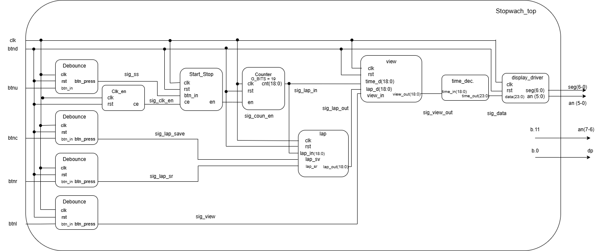

# Projekt 3: Digitální stopky 
**Autor:** Hrbáček, Chmela, Hofman
## projektu
Tento projekt implementuje plně funkční digitální stopky. Stopky měří čas s přesností na setiny sekundy, umožňují pozastavení čítání, ukládání mezičasů (lap time) a jejich následné zobrazení na 7segmentovém displeji.

## Jak to funguje

Systém je rozdělen do několika logických bloků, které spolu komunikují uvnitř hlavního modulu

## Architektura (Blokové schéma)

**Vstupy (Inputs):**
* **`clk`** : Hlavní hodinový signál z desky .
* **`btnd`** : Globální reset pro vynulování celého systému .
* **`btnu`** : Tlačítko nahoru (spuštění a pozastavení stopek).
* **`btnc`** : Prostřední tlačítko (uložení aktuálního času do paměti).
* **`btnr`** : Pravé tlačítko (listování v paměti mezičasů).
* **`btnl`** : Levé tlačítko (přepínání zobrazení mezi běžícím časem a pamětí).

### Výstupy (Outputs)
* **`seg`** : Řízení jednotlivých segmentů (A-G)
* **`dp`** : Desetinná tečka
* **`an`**

# Dokumentace modulů stopek (Stopwatch)

Tato sekce popisuje jednotlivé moduly projektu podle blokového schématu a ověřené simulace.

### **Stopwach_top** (Hlavní modul stopek)
Top-level modul, který propojuje veškerou vnitřní logiku stopek (odrušení tlačítek, počítání, paměť, multiplexování zobrazení a řízení displeje) do jednoho celku.
* Integruje 5 tlačítek na vstupu a převádí je na řídicí signály pomocí modulů `debounce`.
* Směruje zpracovaná data (`sig_data`) do modulu `display_driver`, který fyzicky řídí anody (`an[7:0]`) a katody (`seg[6:0]`) sedmisegmentového displeje.

### **debounce** (Odrušení tlačítek)
Modul zabraňující nežádoucím zákmitům mechanických tlačítek. Simulace ověřuje tyto testovací případy:
* **Ignorování šumu:** Krátký stisk tlačítka (do 10 ms) modul správně vyhodnotí jako šum a řídicí pulz nevygeneruje.
* **Platný stisk:** Dlouhý stisk tlačítka (např. `btnc` okolo 60–85 ms) je bezpečně propuštěn a na výstupu se vygeneruje korektní jednoclockový pulz (např. `sig_lap_save`).

### **clk_en** (Generátor hodinového povolení)
Dělička frekvence, která zpomaluje hlavní hodiny desky na požadovanou frekvenci pro logiku stopek.
* Na výstupu generuje pravidelné pulzy signálu `sig_clk_en`.
* Pomocí těchto pulzů se synchronizuje a "krokuje" hlavní čítač a další řídicí moduly, čímž je zaručeno přesné odměřování času.

### **Start_Stop** (Klopný obvod chodu)
Modul, který udržuje informaci o tom, zda stopky momentálně běží, nebo stojí.
* Funguje na principu T-klopného obvodu (Toggle). Výchozí stav výstupu `en` (enable) je `0` (stopky stojí).
* Při detekci platného stisku tlačítka Start/Stop (krátký pulz ze signálu `sig_ss` v čase cca 135 ms) trvale přepne stav výstupního signálu `sig_coun_en` na logickou `1`, čímž povolí čítání. 

### **counter** (Hlavní čítač)
Jádro stopek, které se stará o samotné odměřování času.
* Je aktivní pouze ve chvíli, kdy je jeho vstupní signál `en` (připojený na `sig_coun_en`) v logické `1` a dorazí pulz od `clk_en`.
* V simulaci je vidět, že po aktivaci povolovacího signálu začne postupně inkrementovat svou 19bitovou hodnotu (`00001`, `00002`, `00003`...) a odesílá ji na výstup `cnt` (zapojen na `sig_lap_in`).

### **lap** (Paměť mezičasu)
Modul sloužící k uložení aktuálního stavu čítače při požadavku na mezičas. 
* Při příchodu pulzu na vstup `lap_sv` (`sig_lap_save` v čase cca 85 ms) okamžitě zapíše na svůj výstup aktuální hodnotu z vnitřního čítače (např. `00006`).
* Tuto hodnotu trvale drží na svém výstupu `lap_out`, dokud nepřijde signál pro reset paměti (`lap_sr`) nebo požadavek na nový mezičas.

### **view** (Multiplexer zobrazení)
Inteligentní přepínač, který rozhoduje, jaký čas se pošle uživateli na displej.
* **Normální běh:** Když je signál `sig_view` na úrovni `0`, modul propouští aktuální běžící čas přímo z čítače.
* **Režim mezičasu:** Při stisku tlačítka View (aktivace `sig_view` od času cca 115 ms) modul přepne vstup. Na výstup `sig_view_out` pošle "zmrazenou" hodnotu z paměti lap (`00006`), i když čítač na pozadí dál roste (`0000a`, `0000b`).

### **time_dec** (Dekodér času)
Modul pro přepočet hrubé binární hodnoty pro potřeby displeje.
* Na vstup `time_in` přijímá aktuální 19bitová data z multiplexeru (např. hodnotu `00006` ze `sig_view_out`).
* Na 24bitovém výstupu `time_out` (`sig_data`) ji rozdělí na šest samostatných 4bitových číslic ve formátu BCD (na ukázce hodnota `000006`).

### **display_driver** (Řadič sedmisegmentového displeje)
Modul zodpovědný za fyzické zobrazení čísel na 7-segmentovém displeji vývojové desky.
* Přebírá 24bitová data (`sig_data`) a plynule s nimi multiplexuje displej.
* Signály pro anody `an[7:0]` a katody segmentů `seg[6:0]` v simulaci neustále střídají hodnoty, což potvrzuje nepřetržité a správné přepínání číslic.

## Rozdělení práce na projektu 

### Hrbáček
* Stopwatch_top
* Github
* Schéma
* view
### Hofman
* Start&Stop 
* lap 
* Constraints file
### Chmela
* time_dec 
* display_driver

## Použité nástroje
* Google Geminy
* Vivado 2025.2
* ChatGPT
* draw.io
* Microsoft Powerpoint

