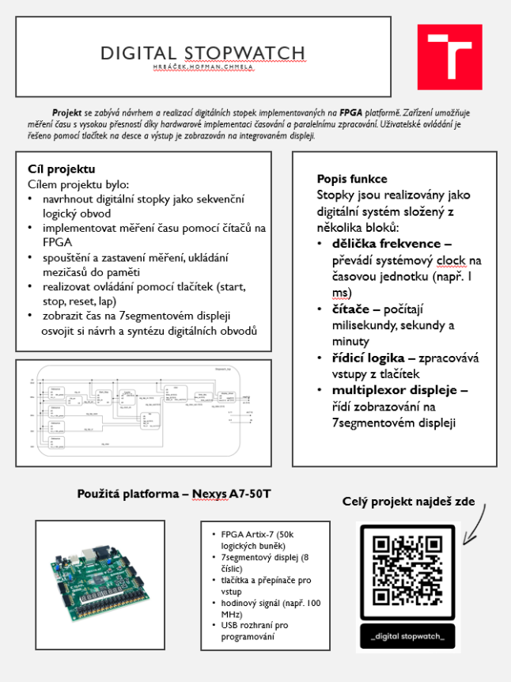
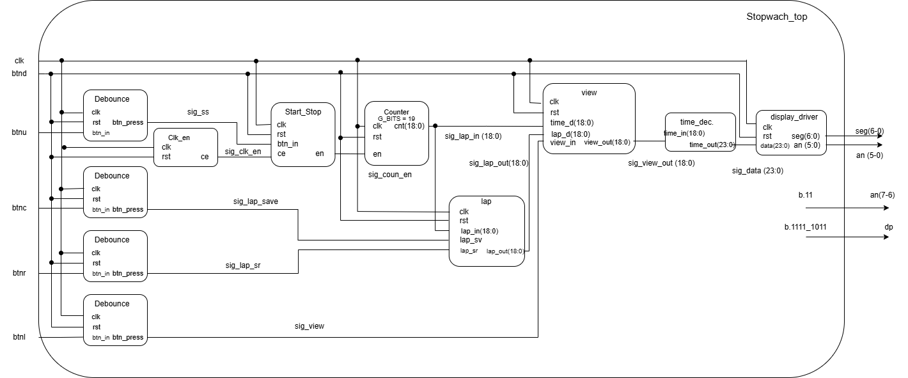
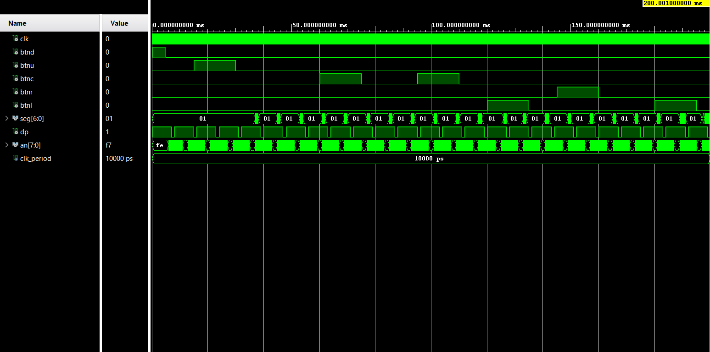
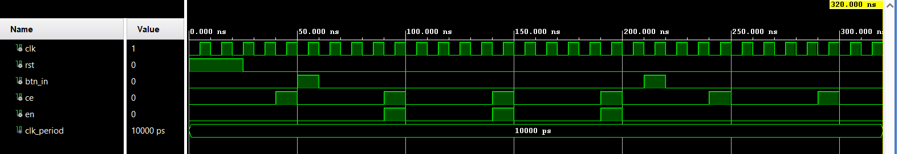
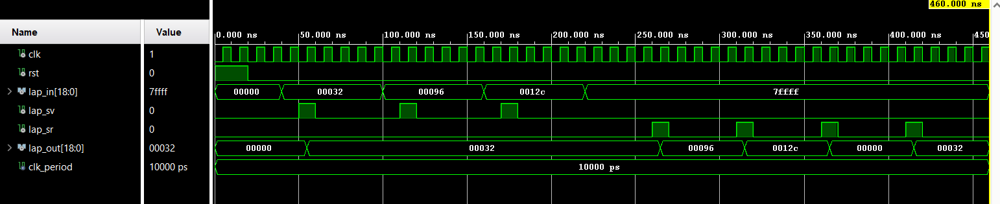
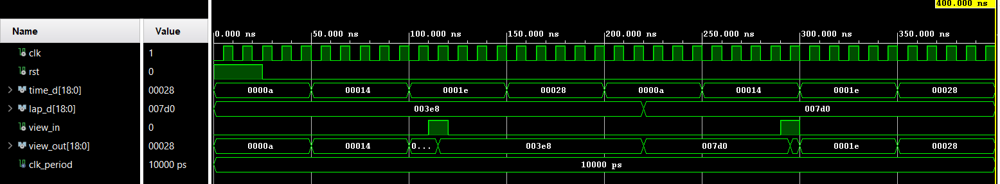
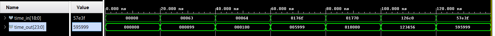
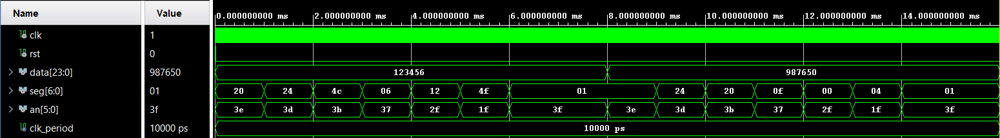

# Projekt 3: Digitální stopky
**Autoři:** Hrbáček, Chmela, Hofman

## Popis projektu
Tento projekt implementuje plně funkční digitální stopky. Stopky měří čas s přesností na setiny sekundy, umožňují pozastavení čítání, ukládání mezičasů (lap time) a jejich následné zobrazení na 7segmentovém displeji.

## Jak to funguje
Systém je rozdělen do několika logických bloků, které spolu komunikují uvnitř hlavního modulu.

## Architektura (Blokové schéma)

### Vstupy (Inputs)

| Název signálu | Velikost | Popis |
| :--- | :--- | :--- |
| **`clk`** | 1-bit | Hlavní hodinový signál z desky. |
| **`btnd`** | 1-bit | Globální reset pro vynulování celého systému. |
| **`btnu`** | 1-bit | Tlačítko nahoru (spuštění a pozastavení stopek). |
| **`btnc`** | 1-bit | Prostřední tlačítko (uložení aktuálního času do paměti). |
| **`btnr`** | 1-bit | Pravé tlačítko (listování v paměti mezičasů). |
| **`btnl`** | 1-bit | Levé tlačítko (přepínání zobrazení mezi běžícím časem a pamětí). |

### Výstupy (Outputs)

| Název signálu | Velikost | Popis |
| :--- | :--- | :--- |
| **`seg`** | 7-bit `[6:0]` | Řízení jednotlivých segmentů (A-G). |
| **`dp`** | 1-bit | Desetinná tečka. |
| **`an`** | 8-bit `[7:0]` | Řízení anod (výběr aktivní číslice na displeji). |

### Vnitřní signály (Internal Signals)

| Název signálu | Velikost | Popis |
| :--- | :--- | :--- |
| **`sig_clk_en`** | 1-bit | Povolovací signál hodin (pulz 100 Hz pro chod stopek). |
| **`sig_ss`** | 1-bit | Ošetřený stisk tlačítka pro Start/Stop. |
| **`sig_lap_save`** | 1-bit | Ošetřený stisk tlačítka pro uložení mezičasu. |
| **`sig_lap_sr`** | 1-bit | Ošetřený stisk tlačítka pro listování mezičasy. |
| **`sig_view`** | 1-bit | Ošetřený stisk tlačítka pro přepínání zobrazení. |
| **`sig_coun_en`** | 1-bit | Stavový signál (běh / zastavení stopek). |
| **`sig_lap_in`** | 19-bit `[18:0]` | Aktuální běžící čas z čítače vstupující do paměti. |
| **`sig_lap_out`** | 19-bit `[18:0]` | Čas načtený z paměti mezičasů. |
| **`sig_view_out`** | 19-bit `[18:0]` | Vybraný čas jdoucí do dekodéru. |
| **`sig_data`** | 24-bit `[23:0]` | Dekódovaný čas připravený pro displej. |
---

## Dokumentace modulů stopek (Stopwatch)

### **[Stopwach_top](Stopwach_top/Stopwach_top.srcs/sim_1/new/tb_Stopwach_top.vhd)** (Hlavní modul stopek)

* **0 – 10 ms (`btnd`):** Globální reset celého systému.
* **20 – 40 ms (`btnu`):** Start stopek (aktivace čítání).
* **60 – 80 ms a 90 – 110 ms (`btnc`):** Uložení prvního a následně druhého mezičasu do paměti během nepřerušeného běhu stopek.
* **120 – 140 ms (`btnl`):** Přepnutí zobrazení displeje z běžícího času na režim prohlížení paměti.
* **140 – 160 ms (`btnr`):** Listování mezi uloženými časy uvnitř paměti.
* **180 – 200 ms (`btnl`):** Opětovné stisknutí tlačítka a návrat zobrazení zpět na aktuální běžící čas.

### **[Start_Stop](tb_start_stop.vhd)** (Klopný obvod chodu)

* **0 – 25 ns (`rst`):** Na začátku je aktivní reset, který modul bezpečně inicializuje do vypnutého stavu. Povolovací pulzy na vstupu `ce` (např. ve 40 ns) se na výstup `en` nedostanou.
* **Kolem 55 ns (START):** Přichází první krátký pulz na vstup `btn_in`, což simuluje stisk tlačítka. Obvod se vnitřně překlopí do stavu "běží".
* **90 ns – 200 ns (Běh stopek):** Je jasně vidět, že výstupní signál `en` nyní přesně kopíruje vstupní povolovací pulzy `ce`. V tomto stavu by stopky čítaly čas.
* **Kolem 205 ns (STOP):** Přichází druhý stisk tlačítka `btn_in`. Obvod se překlápí zpět do stavu "zastaveno".
* **Od 210 ns dále (Zastavené stopky):** Výstup `en` trvale zůstává na logické `0`. Přestože vstupní signál `ce` nadále pravidelně pulzuje modul tyto pulzy blokuje, čímž zastaví čítání stopek.

### **[lap](tb_lap.vhd)** (Paměť mezičasu)

* **0 – 20 ns (`rst`):** Na začátku je aktivní signál `rst`, který paměť resetuje.
* **Zápis do paměti (`lap_sv`):** * Kolem času **50 ns** je na vstupu `lap_in` hodnota `00032` (dekadicky 50). Přichází první pulz `lap_sv` a hodnota se ukládá. Výstup `lap_out` rovnou ukazuje tento první uložený čas. V čase **110 ns** a **170 ns** se na vstup přivádí další časy (`00096` a `0012c`)
* **Listování v paměti (`lap_sr`):**
  * Od času **270 ns** přicházejí pulzy na signál `lap_sr` (čtení/rotace). 
  * S prvním pulzem se výstup `lap_out` změní na druhý uložený čas `00096`.
  * S druhým pulzem (330 ns) naskočí třetí uložený čas `0012c`.

### **[view](tb_view.vhd)** (Multiplexer zobrazení)

* **0 – 25 ns (`rst`):** Systém se po resetu nastaví do výchozího stavu.
* **25 ns – 130 ns (Výchozí režim):** Na vstupu `time_d` je vidět, jak se hodnoty simulovaně mění. Výstup `view_out` tyto hodnoty okamžitě a přesně kopíruje. Modul tedy správně posílá běžící čas dál do obvodu.
* **Kolem 130 ns (První stisk tlačítka):** Přichází pulz na signál `view_in`, čímž dáváme obvodu povel k zobrazení paměti.
* **130 ns – 270 ns (Režim zobrazení paměti):** Výstup `view_out` se po hraně hodin přepne a začne propouštět hodnoty ze vstupu `lap_d`. Kolem času 220 ns je také otestováno, že pokud se hodnota v paměti změní, modul ji správně a plynule propustí na výstup. Běžící čas na `time_d` na pozadí dál neustále běží, ale na výstup se nyní nedostane.
* **Kolem 270 ns (Druhý stisk tlačítka):** Další pulz na `view_in` dává povel k návratu na normální zobrazení.

### **[time_dec](tb_time_dec.vhd)** (Dekodér času)

* **0 ns:** Čas 0 se správně dekóduje jako `000000`.
* **20 ns:** 99 setin (těsně před vteřinou) se přeloží jako `000099`.
* **40 ns:** 100 setin se správně překlopí na 1 vteřinu a nula setin: `000100`.
* **60 ns:** 5999 setin (těsně před minutou) dává `005999`.
* **80 ns:** 6000 setin se překlopí na přesně 1 minutu: `010000`.
* **100 ns:** Náhodný čas (75456 setin) se ukáže jako 12 minut, 34 sekund a 56 setin: `123456`.
* **120 ns:** Maximální zobrazitelný čas (359999 setin) se dekóduje jako `595999`.

### **[display_driver](tb_display_driver.vhd)** (Řadič sedmisegmentového displeje)

* **Základní rotace (0–14 ms):** Signál `an` neustále a pravidelně rotuje hexadecimální hodnoty `3e`, `3d`, `3b`, `37`, `2f` a `1f`. To znamená, že je vždy na jednom pinu logická nula (tzv. "chodící nula"), čímž se cyklicky aktivuje vždy pouze jeden ze šesti displejů.
* **Časování:** Přepnutí na další anodu probíhá přesně každou 1 milisekundu.
* **Zobrazení hodnoty 123456 (0–8 ms):** Na vstupu jsou data `123456`. Výstup `seg` na to reaguje tak, že synchronně s rotací anód posílá na displej kódy pro příslušné číslice z této hodnoty.
* **Změna zobrazení (8 ms):** Vstupní data se skokově změní na hodnotu `987650`. Ovladač na signálu `an` plynule pokračuje v rotaci bez přerušení, ale na výstupu `seg` okamžitě začne generovat nové kódy odpovídající tomuto novému času.

### Programy od doc. Ing. Tomáš Frýza, Ph.D. 
[Programy k nalezení](https://github.com/tomas-fryza/vhdl-examples/tree/master/examples/_solutions)
* **debounce** (Odrušení tlačítek)
* **clk_en** (Generátor hodinového povolení)
* **counter** (Hlavní čítač)

## Rozdělení práce na projektu 
### Hrbáček
* `Stopwatch_top` (hlavní modul)
* Správa GitHub repozitáře
* Blokové schéma projektu
* Modul `view`

### Hofman
* Modul `Start_Stop`
* Modul `lap`
* Vytvoření a mapování Constraints filu

### Chmela
* Modul `time_dec`
* Modul `display_driver`

## Použité nástroje
* Google Gemini
* ChatGPT
* Vivado 2025.2
* draw.io
* Microsoft PowerPoint
